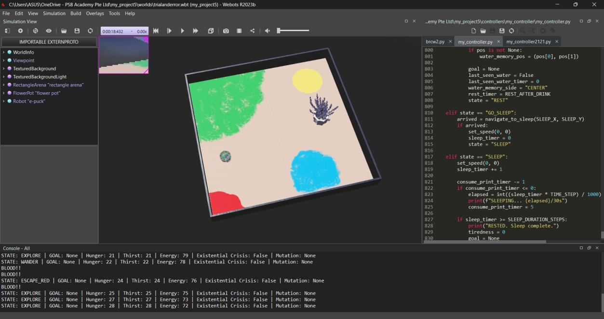
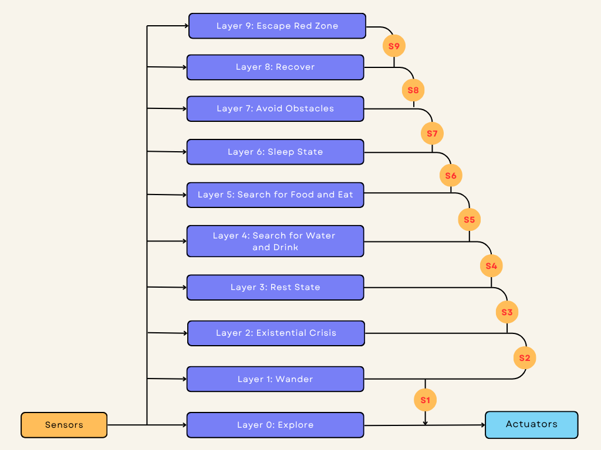
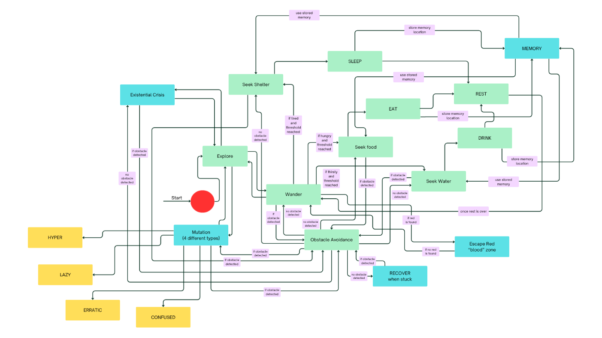

# E-puck Survival Robot – Subsumption Architecture (Webots)

**Module:** 5FTC2066 Behavioural Robotics – Coursework 2
**Tools:** Python, Webots R2023b, e-puck robot

For this coursework I made an e-puck robot in Webots "survive" on its own in a small arena. It has hunger, thirst and tiredness levels that go up over time. When one of them gets too high, it goes looking for food, water or a place to sleep. All of this is controlled with a subsumption architecture, so the more important behaviours (like escaping danger or avoiding walls) always override the less important ones.



## The arena

The floor has four coloured zones, and the robot picks them out with its camera:

| Colour | Meaning |
|---|---|
| 🟩 Green | Food |
| 🟦 Blue | Water |
| 🟨 Yellow | Sleep zone |
| 🟥 Red | Danger ("blood") zone – get out fast |

## Behaviours

**Core behaviours**
- **Explore / Wander** – moves around when nothing is urgent. Wander adds random timers and turns so the robot doesn't keep taking the same route.
- **Avoid obstacles** – uses the 8 proximity sensors to back off and turn away.
- **Search food → Eat** – triggered when hunger passes 60%. The robot steers towards green, then stops on the patch and eats until full.
- **Search water → Drink** – the same idea for thirst (70%) and blue patches.
- **Go to sleep → Sleep** – when tiredness passes 75%, it uses GPS + IMU to drive to the yellow zone and sleeps for 30 seconds.

**Extra behaviours I added**
- **Rest** – a short pause after eating, drinking or sleeping, so it doesn't jump straight into the next state.
- **Memory** – it remembers which side it last saw food or water on, and the exact spot where it last ate or drank. It then drives back there next time instead of searching randomly.
- **Escape red zone** – the red zone overrides everything except recovery. It prints `BLOOD!!` and drives away from the side the red is on.
- **Recover** – if it keeps getting blocked, it reverses, spins, and then drives forward to get unstuck.
- **Existential crisis** – when it has no needs at all, it does a little wiggle-and-spin routine before going back to exploring.
- **Mutation** – while exploring, there's a small random chance it switches into a temporary mode: HYPER (faster), LAZY (slower), CONFUSED (noisy wheel speeds) or ERRATIC (randomly swaps its wheels).

## Subsumption layers

Higher layers override lower ones:



## State machine



## How to run

1. Install [Webots R2023b](https://cyberbotics.com/) (newer versions should work too).
2. Open `worlds/survival_arena.wbt`.
3. The e-puck is already set to use `my_controller`, so just press play.
4. Watch the console. Every few steps it prints the current state, the goal, and the hunger / thirst / energy levels.

```
STATE: SEARCH_FOOD | GOAL: FOOD | Hunger: 61 | Thirst: 61 | Energy: 39 | ...
EATING... Fullness = 72%
```

## Project structure

```
controllers/my_controller/my_controller.py   – the robot controller
worlds/survival_arena.wbt                    – the Webots world
worlds/textures/arena_floor.png              – floor with the coloured zones
images/                                      – screenshots and diagrams
```

## What I learnt / limitations

- Some behaviours came out that I never programmed directly. In CONFUSED or ERRATIC mode, the robot would sometimes do odd things next to walls, just from the mutation mixing with the normal movement code. That's the main idea of subsumption: simple rules can add up to complex behaviour.
- The need thresholds are fixed, so the robot can't adapt them to its surroundings.
- Memory only keeps one spot each for food and water, and the "last seen side" memory fades quite quickly.
- Colour detection uses simple RGB thresholds, so it would struggle with different lighting.
- There's no learning, so the robot doesn't get any better over time. Adding something like reinforcement learning would be the next step.

---

© 2026 Sudharsan Vijaya Kumaran. All rights reserved.
Developed as coursework for 5FTC2066 Behavioural Robotics (University of Hertfordshire).
